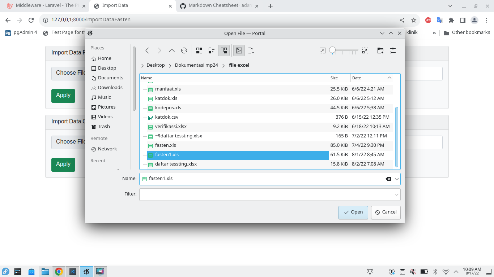

## midleware
---

di sini  midleware adalah teknik buat mengatur rule users , dengan case 2 table (users dan fastens) di bagi 1 login dengan group rule 11 unit 

- setup 

lokasi file

```txt
app/Http/Kernel.php
```

## seeder
---

- menjalankan data yang sudah disiapkan

lokasi folder

```txt
database/seeders/
```

```bash
# untuk oprasional data
php artisan db:seed --class=CreateKatdokSeeder
php artisan db:seed --class=CreateKlslynSeeder
php artisan db:seed --class=CreateManfaatSeeder

# untuk users
php artisan db:seed --class=CreateUsersSeeder
php artisan db:seed --class=FastenSeeder
```


## upload file excel
---

- pastikan konfigurasi model pada "exprt excel" bukan "buat login" pada model fasten

```txt
- app/Models/fasten.php

- pastikan seeder CreateKatdokSeeder sudah dijalankan
```

- buka url [upload](http://127.0.0.1:8000/importDataFasten)
- buka fastens1.xls



- jika selesai upload konfigurasi awal pada model "buat login"


## migration
---

aksi migration adalah untuk export database pada setup awal, 

```bash
php artisan migration
```

## model
---

sebuah funsi untuk pengoprasian data lanjutan dari fungsi yang sudah dibuat dalam basisdata


## controller
---

adalah struktur fungsi yang sudah disesuaikan dengan kebutuhan dan dalam penerapan composer yang sudah ter-install


## view
---

blade 

1. blade directive
  - if else
  - auth
  - loop
  - additional atribute
  - include subview ( @include @push )
  

## asset
---

lokasi folder

```txt
public/
```

```txt
keterangan setiap folder

- public/depan (di dalam nya ada js dan css untuk halaman depan)
- depan (di dalam nya ada js dan css untuk halaman depan)
```

## composer
---

lokasi 

```txt
composer.json
```

```php
"require": {
        "php": "^8.0.2",
        "barryvdh/laravel-dompdf": "^1.0",
        "doctrine/dbal": "^3.3",
        "elibyy/tcpdf-laravel": "^9.0",
        "gidkom/php-openfire-restapi": "^1.0",
        "guzzlehttp/guzzle": "^7.4",
        "haruncpi/laravel-id-generator": "^1.1",
        "laravel/framework": "^9.11",
        "laravel/passport": "^10.4",
        "laravel/sanctum": "^2.15",
        "laravel/tinker": "^2.7",
        "laravel/ui": "^3.4",
        "laravelcollective/html": "~6.0",
        "laraveldaily/laravel-invoices": "3.0",
        "maatwebsite/excel": "^3.1",
        "psr/http-client": "^1.0",
        "psr/simple-cache": "1.0",
        "simplesoftwareio/simple-qrcode": "^4.2",
        "yajra/laravel-datatables-oracle": "^10.0"
    },
```


# File Dokumentasi manajemen
---

- sebelum ganti os linux [file_excel](/gambar_dok/daftar.xlsx)

- sesudah ganti os linux


# Video 
---


<video width="320" height="240" controls>
  <source src="gambar_dok/test.mp4" type="video/mp4">
</video>


pass 123456

administrator@mp24.com
validator@mp24.com
dokter@mp24.com
apotik@mp24.com
pasien@mp24.com
pasienturunan@mp24.com